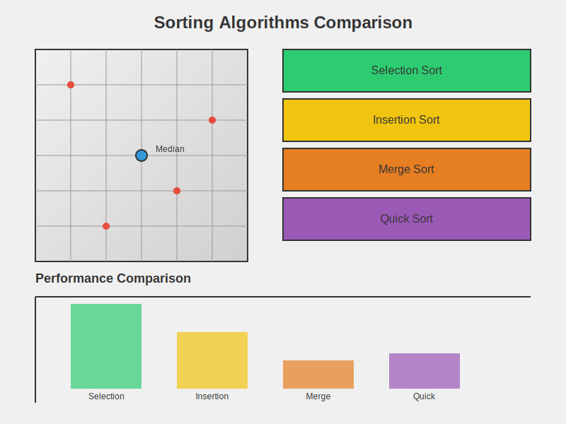

# Sorting Algorithms Comparison



## Description

This project implements and compares four sorting algorithms (Selection Sort, Insertion Sort, Merge Sort, and Quick Sort) for sorting 2D integer points in a coordinate plane. The main goal is to find the median coordinate point by sorting the input points separately by their x and y coordinates. The project demonstrates object-oriented design, algorithm implementation, and performance comparison in Java.

## Features

- Implementation of four sorting algorithms:
  - Selection Sort
  - Insertion Sort
  - Merge Sort
  - Quick Sort
- Ability to read points from a file or generate random points
- Comparison of sorting algorithm performance
- Calculation of median coordinate point
- Flexible point comparison (by x or y coordinate)

## Project Structure

The project consists of several key classes:

1. `AbstractSorter`: An abstract base class for all sorting algorithms
2. `SelectionSorter`: Implements the Selection Sort algorithm
3. `InsertionSorter`: Implements the Insertion Sort algorithm
4. `MergeSorter`: Implements the Merge Sort algorithm
5. `QuickSorter`: Implements the Quick Sort algorithm
6. `Point`: Represents a 2D point with x and y coordinates
7. `PointScanner`: Handles input/output and initiates sorting
8. `CompareSorters`: Main class for running and comparing sorting algorithms
9. `Algorithm`: Enum class defining the available sorting algorithms

## How to Run

1. Compile all Java files in the `edu.iastate.cs228.hw2` package.
2. Run the `CompareSorters` class.
3. Follow the prompts to either:
   a. Generate random points
   b. Read points from a file
4. The program will execute all four sorting algorithms and display their performance statistics.

## Usage Example

```java
public class SortingDemo {
    public static void main(String[] args) throws FileNotFoundException {
        // Generate random points
        Point[] randomPoints = CompareSorters.generateRandomPoints(1000, new Random());
        
        // Create PointScanner instances for each algorithm
        PointScanner selectionScanner = new PointScanner(randomPoints, Algorithm.SelectionSort);
        PointScanner insertionScanner = new PointScanner(randomPoints, Algorithm.InsertionSort);
        PointScanner mergeScanner = new PointScanner(randomPoints, Algorithm.MergeSort);
        PointScanner quickScanner = new PointScanner(randomPoints, Algorithm.QuickSort);
        
        // Perform scanning (sorting)
        selectionScanner.scan();
        insertionScanner.scan();
        mergeScanner.scan();
        quickScanner.scan();
        
        // Print statistics
        System.out.println(selectionScanner.stats());
        System.out.println(insertionScanner.stats());
        System.out.println(mergeScanner.stats());
        System.out.println(quickScanner.stats());
    }
}
```

## Class Descriptions

1. `AbstractSorter`: 
   - Abstract base class for all sorting algorithms
   - Implements common functionality like point storage and comparison

2. `SelectionSorter`, `InsertionSorter`, `MergeSorter`, `QuickSorter`:
   - Concrete implementations of sorting algorithms
   - Each extends `AbstractSorter` and implements the `sort()` method

3. `Point`:
   - Represents a 2D point with x and y coordinates
   - Implements `Comparable` interface for flexible comparison

4. `PointScanner`:
   - Handles input/output operations
   - Initiates sorting and calculates median coordinate point

5. `CompareSorters`:
   - Main class for running and comparing sorting algorithms
   - Provides methods for generating random points and reading from files

6. `Algorithm`:
   - Enum class defining the available sorting algorithms

## Performance Comparison

The project allows for easy comparison of the four sorting algorithms' performance. It measures the time taken by each algorithm to sort the same set of points and displays the results, helping to visualize the efficiency differences between the algorithms.

## Future Improvements

- Implement additional sorting algorithms (e.g., Heap Sort, Radix Sort)
- Add visualization of the sorting process
- Extend to support 3D points
- Implement parallel sorting for large datasets
- Add more sophisticated statistical analysis of algorithm performance

## Testing

The project includes several test cases to ensure the correctness of the implementations. To run the tests:

1. Implement JUnit test classes for each sorter and the `Point` class.
2. Run the tests to verify the correctness of sorting algorithms and point comparisons.

## Author

Abhay Prasanna Rao